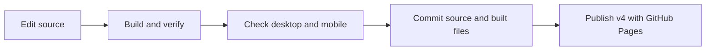

# Veeramanohar portfolio

The site keeps the blue glass shader, silhouette, Adobe fonts, and scroll reveal. GSAP animates the preloader words with masked letters and a short curtain transition.

## Develop and build

Use Node.js 22.12 or later.

```sh
npm ci
npm run dev
npm run check
npm run build
npm run verify
npm run preview
```

Edit `src/index.html`, `src/styles.css`, `src/script.js`, `src/scene.js`, and `src/shaders.js`. Put fixed public files in `public/`. The shader and its rendering quality are unchanged. `scene.js` shares one renderer between desktop and mobile layouts.

The build writes `dist/` and copies its files to the repository root. Commit the generated root HTML, assets, and public files with each source change. GitHub Pages can continue to publish the `v4` branch at `/` without a new hosting setting. Old hashed assets remain available for visitors with cached HTML. The build workflow checks that committed output matches a fresh build.



## Loading and accessibility

- GSAP and Three.js are pinned and bundled locally. Three.js loads in a separate chunk.
- Unused Google fonts and browser-generated Tailwind CSS are removed. Adobe fonts retain the original typography.
- The intro lasts about 2.3 seconds and has a 3.2-second failure timeout. Content remains visible if its module fails.
- The GPU animation pauses when the hero has faded out or the document is hidden. It resumes when needed. Animation speed is independent of screen refresh rate.
- Reduced motion skips the intro, continuous shader animation, and pinned scroll effect.
- A static gradient and silhouette remain if WebGL fails.
- A single visible heading serves desktop and mobile. A skip link supports keyboard navigation.
- Metadata, JSON-LD, the sitemap, robots file, favicon, and social preview use `https://veeramanohar.in/`.

## Verification

The production build was checked at 320×568, 390×844, 667×375, and 1280×720. Checks covered text spacing, horizontal overflow, scroll reveal, render pause and resume, reduced motion, module failure, and WebGL failure. The production artifact verifier checks local asset paths and deployment metadata.

These checks do not replace field performance data or a throttled Lighthouse audit. Search rankings depend on content and indexing as well as metadata. Update project content when the full portfolio is ready.
